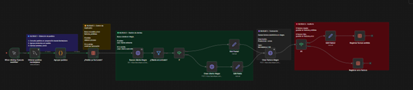

# Marketplace Invoice Automation with n8n

## Overview



This project automates the complete invoicing process for e-commerce orders using **n8n**, **MySQL**, **JavaScript**, and **REST APIs**.

The workflow retrieves pending orders from a database, validates customer records, prevents duplicate invoices, generates invoices through an accounting platform API, and maintains a complete audit trail of successful and failed transactions.

---

## Business Problem

Manual invoice creation is repetitive, time-consuming, and prone to human error.

Typical challenges include:

* Duplicate invoice generation
* Missing customer records
* Manual data entry mistakes
* Lack of traceability
* Difficulty identifying failed transactions

This automation solves those issues by implementing a fully automated invoicing pipeline.

---

## Workflow Architecture

```text
Database
    │
    ▼
Retrieve Pending Orders
    │
    ▼
Group Products by Order
    │
    ▼
Duplicate Validation
    │
    ▼
Customer Validation
    │
 ┌──┴──┐
 │     │
 ▼     ▼
Use    Create
Existing Customer
Customer
 │
 └──┬──┘
    ▼
Generate Invoice
    │
 ┌──┴──┐
 │     │
 ▼     ▼
Success Error
Log     Log
```

---

## Features

### Order Processing

* Retrieves pending orders from a MySQL database
* Consolidates multiple products into a single invoice
* Calculates shipping costs
* Calculates invoice taxable value
* Generates invoice descriptions automatically

### Duplicate Prevention

* Checks previously processed orders
* Prevents duplicate invoice creation
* Maintains invoice history

### Customer Management

* Searches customer records using identification number
* Uses existing customer records when available
* Creates customers automatically when not found

### Automated Invoicing

* Generates invoices through API integration
* Applies tax configuration automatically
* Supports multiple products and shipping charges

### Error Handling

* Captures API errors
* Stores failed transactions for later review
* Maintains complete payload history for debugging

### Audit Trail

* Records successful invoices
* Records failed invoices
* Provides traceability for every processed order

---

## Technologies Used

| Technology  | Purpose                         |
| ----------- | ------------------------------- |
| n8n         | Workflow Orchestration          |
| MySQL       | Order Data Source               |
| JavaScript  | Data Transformation             |
| REST API    | Accounting Platform Integration |
| Data Tables | Logging and Audit Trail         |

---

## Workflow Stages

### Stage 1 — Order Retrieval

Query pending orders from the operational database.

### Stage 2 — Order Consolidation

Group products belonging to the same order and calculate totals.

### Stage 3 — Duplicate Validation

Verify that the order has not already been invoiced.

### Stage 4 — Customer Validation

Search for the customer using identification data.

### Stage 5 — Customer Creation

Create the customer automatically if it does not exist.

### Stage 6 — Invoice Generation

Create the invoice through the accounting API.

### Stage 7 — Success Logging

Store invoice information for audit purposes.

### Stage 8 — Error Logging

Store failed transactions for future reprocessing.

---

## Example Data Flow

```text
Order Received
      │
      ▼
Order Validated
      │
      ▼
Customer Found?
   │       │
 Yes      No
   │       │
   │   Create Customer
   │       │
   └───┬───┘
       ▼
Generate Invoice
       │
       ▼
Success / Error Log
```

---

## Key Benefits

* Reduced manual workload
* Faster invoice generation
* Improved data consistency
* Prevention of duplicate invoices
* Automated customer management
* Full process traceability
* Easier operational monitoring

---

## Future Improvements

* Email notifications
* Automatic retry logic
* Dashboard monitoring
* Multi-company support
* Multi-marketplace integration
* KPI reporting with Power BI

---

## Author

Industrial Engineer focused on:

* Process Automation
* Business Intelligence
* Data Analysis
* Workflow Design
* Digital Transformation

Built with n8n, JavaScript, SQL and API integrations.
